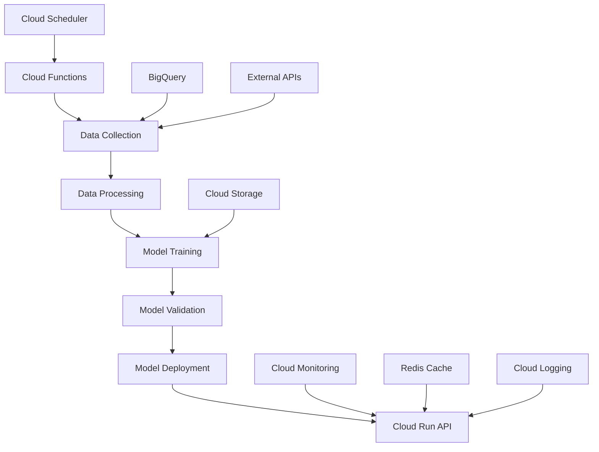

# 🤖 **AUTOMATIZACIÓN DEL MODELO ML EN GCP**
## Sistema de Actualización Continua y Entrenamiento Automático

> **Documentación técnica completa del sistema de automatización del modelo de Machine Learning en Google Cloud Platform**

---

## 🎯 **RESUMEN EJECUTIVO**

El sistema Steel Rebar Price Predictor implementa un **entrenamiento automático continuo** que permite al modelo ML mejorar constantemente su precisión mediante la incorporación de nuevos datos y el reentrenamiento periódico. Este proceso está completamente automatizado en GCP usando **Cloud Scheduler**, **Cloud Functions**, y **Cloud Run**.

### **📊 Beneficios del Sistema Automatizado**
- **🔄 Actualización continua**: Datos frescos cada día
- **📈 Mejora de precisión**: Modelo se adapta a nuevas condiciones de mercado
- **⚡ Sin intervención manual**: Proceso completamente automatizado
- **💰 Optimización de costos**: Uso eficiente de recursos GCP
- **📊 Monitoreo en tiempo real**: Alertas y métricas automatizadas

---

## 🏗️ **ARQUITECTURA DEL SISTEMA**

### **📋 Componentes Principales**



### **🔄 Flujo de Automatización**

1. **📅 Programación**: Cloud Scheduler ejecuta jobs según cronograma
2. **📊 Recolección**: Cloud Functions recolecta datos de fuentes externas
3. **🔄 Procesamiento**: Datos se limpian y preparan para entrenamiento
4. **🤖 Entrenamiento**: Modelo se reentrena con datos actualizados
5. **✅ Validación**: Nuevo modelo se valida contra datos de prueba
6. **🚀 Despliegue**: Modelo validado se despliega automáticamente
7. **📈 Monitoreo**: Sistema monitorea rendimiento del nuevo modelo

---

## ⏰ **PROGRAMACIÓN AUTOMÁTICA CON CLOUD SCHEDULER**

### **📅 Jobs Programados**

#### **1. Actualización Diaria de Datos**
```bash
# Job: daily-data-update
gcloud scheduler jobs create http daily-data-update \
    --schedule="0 2 * * *" \
    --uri="https://steel-rebar-predictor-646072255295.us-central1.run.app/update-data" \
    --http-method=POST \
    --headers="X-API-Key=deacero_steel_predictor_2025_key" \
    --time-zone="America/Mexico_City" \
    --description="Actualización diaria de datos de mercado a las 2:00 AM"
```

**Frecuencia**: Diario a las 2:00 AM (hora de México)  
**Propósito**: Recolectar datos frescos de todas las fuentes  
**Duración estimada**: 5-10 minutos  

#### **2. Reentrenamiento Semanal del Modelo**
```bash
# Job: weekly-retraining
gcloud scheduler jobs create http weekly-retraining \
    --schedule="0 3 * * 1" \
    --uri="https://steel-rebar-predictor-646072255295.us-central1.run.app/retrain-model" \
    --http-method=POST \
    --headers="X-API-Key=deacero_steel_predictor_2025_key" \
    --time-zone="America/Mexico_City" \
    --description="Reentrenamiento semanal del modelo ML los lunes a las 3:00 AM"
```

**Frecuencia**: Semanal (lunes a las 3:00 AM)  
**Propósito**: Reentrenar modelo con datos acumulados de la semana  
**Duración estimada**: 15-30 minutos  

#### **3. Monitoreo de Rendimiento**
```bash
# Job: performance-monitoring
gcloud scheduler jobs create http performance-monitoring \
    --schedule="0 */6 * * *" \
    --uri="https://steel-rebar-predictor-646072255295.us-central1.run.app/monitor-performance" \
    --http-method=POST \
    --headers="X-API-Key=deacero_steel_predictor_2025_key" \
    --time-zone="America/Mexico_City" \
    --description="Monitoreo de rendimiento cada 6 horas"
```

**Frecuencia**: Cada 6 horas  
**Propósito**: Verificar salud del sistema y métricas de rendimiento  
**Duración estimada**: 2-5 minutos  

---

## 📊 **PROCESO DE RECOLECCIÓN DE DATOS**

### **🔄 Flujo de Datos Automatizado**

#### **1. Fuentes de Datos Integradas**
```python
# Fuentes configuradas para actualización automática
DATA_SOURCES = {
    "yahoo_finance": {
        "frequency": "daily",
        "endpoints": ["steel_futures", "commodity_indices"],
        "cache_ttl": 3600  # 1 hora
    },
    "alpha_vantage": {
        "frequency": "daily", 
        "endpoints": ["steel_stocks", "commodity_etfs"],
        "rate_limit": "5_calls_per_minute"
    },
    "fred_api": {
        "frequency": "daily",
        "endpoints": ["economic_indicators", "inflation_data"],
        "cache_ttl": 86400  # 24 horas
    },
    "trading_economics": {
        "frequency": "daily",
        "endpoints": ["commodity_prices", "economic_calendar"],
        "cache_ttl": 7200  # 2 horas
    }
}
```

#### **2. Proceso de Recolección Automatizada**
```python
async def collect_daily_data():
    """Recolección diaria automatizada de datos."""
    
    collected_data = {}
    
    for source, config in DATA_SOURCES.items():
        try:
            # Verificar cache primero
            cached_data = cache_service.get_data(source)
            if cached_data and not is_expired(cached_data, config['cache_ttl']):
                collected_data[source] = cached_data
                continue
            
            # Recolectar datos frescos
            fresh_data = await data_collector.fetch_data(source)
            collected_data[source] = fresh_data
            
            # Actualizar cache
            cache_service.set_data(source, fresh_data, config['cache_ttl'])
            
            logger.info(f"✅ {source}: {len(fresh_data)} registros recolectados")
            
        except Exception as e:
            logger.error(f"❌ Error recolectando {source}: {e}")
            # Usar datos en cache como fallback
            if cached_data:
                collected_data[source] = cached_data
    
    return collected_data
```

---

## 🤖 **ENTRENAMIENTO AUTOMÁTICO DEL MODELO**

### **🔄 Proceso de Reentrenamiento**

#### **1. Trigger de Reentrenamiento**
```python
@app.post("/retrain-model")
async def retrain_model(api_key: str = Depends(verify_api_key)):
    """Endpoint para reentrenamiento automático del modelo."""
    
    try:
        logger.info("🔄 Iniciando reentrenamiento automático...")
        
        # 1. Recolectar datos actualizados
        logger.info("📊 Recolectando datos actualizados...")
        fresh_data = await collect_daily_data()
        
        # 2. Combinar datos para entrenamiento
        logger.info("🔄 Combinando datos para entrenamiento...")
        training_data = data_processor.combine_data(fresh_data)
        
        # 3. Validar calidad de datos
        logger.info("✅ Validando calidad de datos...")
        data_quality = validate_data_quality(training_data)
        
        if data_quality['score'] < 0.8:
            raise ValueError(f"Calidad de datos insuficiente: {data_quality['score']}")
        
        # 4. Entrenar modelo
        logger.info("🤖 Entrenando nuevo modelo...")
        training_result = ml_model.train(training_data)
        
        # 5. Validar nuevo modelo
        logger.info("✅ Validando nuevo modelo...")
        validation_result = validate_model(training_result['model'])
        
        if validation_result['mape'] > 0.05:  # 5% MAPE threshold
            raise ValueError(f"Modelo no cumple criterios: MAPE {validation_result['mape']}")
        
        # 6. Desplegar nuevo modelo
        logger.info("🚀 Desplegando nuevo modelo...")
        deployment_result = deploy_model(training_result['model'])
        
        # 7. Actualizar métricas
        logger.info("📊 Actualizando métricas...")
        update_model_metrics(training_result, validation_result)
        
        return {
            "status": "success",
            "training_result": training_result,
            "validation_result": validation_result,
            "deployment_result": deployment_result,
            "timestamp": datetime.now().isoformat()
        }
        
    except Exception as e:
        logger.error(f"❌ Error en reentrenamiento: {e}")
        return {
            "status": "error",
            "error": str(e),
            "timestamp": datetime.now().isoformat()
        }
```

#### **2. Validación de Modelo**
```python
def validate_model(model):
    """Validar nuevo modelo antes del despliegue."""
    
    # Cargar datos de validación
    validation_data = load_validation_data()
    
    # Hacer predicciones
    predictions = model.predict(validation_data['features'])
    actuals = validation_data['target']
    
    # Calcular métricas
    mape = mean_absolute_percentage_error(actuals, predictions)
    r2 = r2_score(actuals, predictions)
    rmse = np.sqrt(mean_squared_error(actuals, predictions))
    
    # Verificar criterios de aceptación
    criteria_met = {
        'mape_threshold': mape <= 0.05,  # 5% máximo
        'r2_threshold': r2 >= 0.90,      # 90% mínimo
        'rmse_threshold': rmse <= 50     # $50/ton máximo
    }
    
    return {
        'mape': mape,
        'r2': r2,
        'rmse': rmse,
        'criteria_met': criteria_met,
        'model_accepted': all(criteria_met.values())
    }
```

---

## 📈 **MONITOREO Y MÉTRICAS AUTOMATIZADAS**

### **📊 Métricas Monitoreadas**

#### **1. Métricas del Modelo**
- **MAPE (Mean Absolute Percentage Error)**: Precisión del modelo
- **R² (Coeficiente de Determinación)**: Correlación con datos reales
- **RMSE (Root Mean Square Error)**: Error absoluto promedio
- **Drift Score**: Detección de deriva en datos

#### **2. Métricas del Sistema**
- **Latencia de respuesta**: Tiempo de respuesta de la API
- **Throughput**: Requests por segundo
- **Disponibilidad**: Uptime del servicio
- **Uso de recursos**: CPU, memoria, almacenamiento

#### **3. Métricas de Costo**
- **Costo mensual**: Gastos totales en GCP
- **Costo por predicción**: Costo promedio por request
- **Eficiencia de recursos**: Uso vs. asignación

### **🚨 Sistema de Alertas**

```python
# Configuración de alertas automáticas
ALERT_THRESHOLDS = {
    'mape_increase': 0.02,      # 2% aumento en MAPE
    'latency_spike': 2.0,       # 2 segundos de latencia
    'error_rate': 0.05,         # 5% tasa de errores
    'cost_daily': 0.20,         # $0.20 USD por día
    'memory_usage': 0.90,       # 90% uso de memoria
    'cpu_usage': 0.85           # 85% uso de CPU
}

async def check_alert_conditions():
    """Verificar condiciones de alerta automáticamente."""
    
    current_metrics = await get_current_metrics()
    alerts = []
    
    for metric, threshold in ALERT_THRESHOLDS.items():
        if current_metrics[metric] > threshold:
            alerts.append({
                'metric': metric,
                'current_value': current_metrics[metric],
                'threshold': threshold,
                'severity': 'high' if current_metrics[metric] > threshold * 1.5 else 'medium'
            })
    
    if alerts:
        await send_alerts(alerts)
    
    return alerts
```

---

## 💾 **GESTIÓN DE DATOS Y ALMACENAMIENTO**

### **🗄️ Estrategia de Almacenamiento**

#### **1. Cloud Storage para Datos Históricos**
```bash
# Estructura de buckets
gs://steel-rebar-data/
├── raw-data/           # Datos sin procesar
│   ├── yahoo-finance/
│   ├── alpha-vantage/
│   ├── fred-api/
│   └── trading-economics/
├── processed-data/     # Datos procesados
│   ├── daily/
│   ├── weekly/
│   └── monthly/
├── models/             # Modelos entrenados
│   ├── production/
│   ├── staging/
│   └── backups/
└── predictions/        # Predicciones históricas
    ├── daily/
    └── validation/
```

#### **2. BigQuery para Análisis**
```sql
-- Tabla de métricas diarias
CREATE TABLE `steel_rebar_predictor.metrics_daily` (
    date DATE,
    model_version STRING,
    mape FLOAT64,
    r2_score FLOAT64,
    rmse FLOAT64,
    prediction_count INT64,
    avg_latency_ms FLOAT64,
    cost_usd FLOAT64,
    created_at TIMESTAMP
);

-- Tabla de predicciones vs realidad
CREATE TABLE `steel_rebar_predictor.predictions_vs_reality` (
    prediction_date DATE,
    predicted_price FLOAT64,
    actual_price FLOAT64,
    error_absolute FLOAT64,
    error_percentage FLOAT64,
    model_version STRING,
    created_at TIMESTAMP
);
```

---

## 🔧 **CONFIGURACIÓN DE COSTOS Y OPTIMIZACIÓN**

### **💰 Presupuesto y Alertas de Costo**

```bash
# Configurar presupuesto de $5 USD/mes
gcloud billing budgets create \
    --billing-account=YOUR_BILLING_ACCOUNT \
    --display-name="Steel Rebar API Budget" \
    --budget-amount=5USD \
    --threshold-rule=percent=50 \
    --threshold-rule=percent=80 \
    --threshold-rule=percent=100 \
    --project=steel-rebar-predictor-deacero
```

### **⚡ Optimizaciones de Rendimiento**

#### **1. Configuración de Cloud Run**
```yaml
# Configuración optimizada para costos
spec:
  template:
    metadata:
      annotations:
        autoscaling.knative.dev/maxScale: "3"        # Máximo 3 instancias
        autoscaling.knative.dev/minScale: "0"        # Escalamiento a 0
        run.googleapis.com/cpu-throttling: "true"    # Throttling de CPU
    spec:
      containerConcurrency: 100                      # 100 requests por instancia
      timeoutSeconds: 300                            # Timeout de 5 minutos
      containers:
      - image: gcr.io/PROJECT/steel-rebar-api
        resources:
          limits:
            cpu: "1"                                 # 1 vCPU
            memory: "1Gi"                            # 1GB RAM
```

#### **2. Estrategia de Cache Inteligente**
```python
# Configuración de cache optimizada
CACHE_STRATEGY = {
    'predictions': {
        'ttl': 3600,        # 1 hora para predicciones
        'max_size': '100MB'
    },
    'training_data': {
        'ttl': 86400,       # 24 horas para datos de entrenamiento
        'max_size': '500MB'
    },
    'external_data': {
        'ttl': 7200,        # 2 horas para datos externos
        'max_size': '200MB'
    }
}
```

---

## 📊 **DASHBOARD DE MONITOREO**

### **📈 Métricas en Tiempo Real**

#### **1. Dashboard Principal**
- **Estado del Sistema**: Verde/Amarillo/Rojo
- **Métricas del Modelo**: MAPE, R², RMSE actuales
- **Rendimiento**: Latencia, throughput, disponibilidad
- **Costos**: Gasto diario/mensual, proyección

#### **2. Alertas y Notificaciones**
```python
# Configuración de notificaciones
NOTIFICATION_CHANNELS = {
    'email': 'admin@deacero.com',
    'slack': '#steel-rebar-alerts',
    'sms': '+52-55-XXXX-XXXX'  # Solo alertas críticas
}

# Tipos de alertas
ALERT_TYPES = {
    'model_degradation': {
        'threshold': 0.05,
        'notification': ['email', 'slack'],
        'severity': 'high'
    },
    'system_downtime': {
        'threshold': 0,
        'notification': ['email', 'slack', 'sms'],
        'severity': 'critical'
    },
    'cost_spike': {
        'threshold': 0.25,  # $0.25 USD por día
        'notification': ['email'],
        'severity': 'medium'
    }
}
```

---

## 🚀 **IMPLEMENTACIÓN PASO A PASO**

### **📋 Checklist de Implementación**

#### **1. Configuración Inicial**
```bash
# 1. Habilitar APIs necesarias
gcloud services enable cloudbuild.googleapis.com
gcloud services enable run.googleapis.com
gcloud services enable scheduler.googleapis.com
gcloud services enable monitoring.googleapis.com

# 2. Crear buckets de Cloud Storage
gsutil mb gs://steel-rebar-data
gsutil mb gs://steel-rebar-models

# 3. Configurar Redis
gcloud redis instances create steel-rebar-cache \
    --size=1 \
    --region=us-central1 \
    --redis-version=redis_6_x \
    --tier=basic
```

#### **2. Despliegue de Jobs de Scheduler**
```bash
# Crear jobs de Cloud Scheduler
gcloud scheduler jobs create http daily-data-update \
    --schedule="0 2 * * *" \
    --uri="https://steel-rebar-predictor-646072255295.us-central1.run.app/update-data" \
    --http-method=POST \
    --headers="X-API-Key=deacero_steel_predictor_2025_key"

gcloud scheduler jobs create http weekly-retraining \
    --schedule="0 3 * * 1" \
    --uri="https://steel-rebar-predictor-646072255295.us-central1.run.app/retrain-model" \
    --http-method=POST \
    --headers="X-API-Key=deacero_steel_predictor_2025_key"
```

#### **3. Configuración de Monitoreo**
```bash
# Crear políticas de alertas
gcloud alpha monitoring policies create \
    --policy-from-file=alert-policies.yaml

# Configurar presupuesto
gcloud billing budgets create \
    --billing-account=YOUR_BILLING_ACCOUNT \
    --budget-amount=5USD \
    --threshold-rule=percent=80
```

---

## 📈 **ROADMAP DE MEJORAS**

### **🔄 Mejoras Planificadas**

#### **Q4 2025**
- [ ] **A/B Testing**: Capacidad de probar múltiples modelos
- [ ] **AutoML**: Integración con Vertex AI AutoML
- [ ] **Feature Engineering**: Automatización de creación de features
- [ ] **Ensemble Methods**: Combinación de múltiples modelos

#### **Q1 2026**
- [ ] **Real-time Learning**: Aprendizaje incremental en tiempo real
- [ ] **Multi-commodity**: Expansión a otros commodities
- [ ] **Geographic Models**: Modelos específicos por región
- [ ] **Advanced Analytics**: Análisis de tendencias y patrones

### **📊 Métricas de Éxito**

| Métrica | Objetivo Actual | Objetivo Q4 2025 | Objetivo Q1 2026 |
|---------|----------------|------------------|------------------|
| **MAPE** | < 5% | < 3% | < 2% |
| **Disponibilidad** | > 99% | > 99.5% | > 99.9% |
| **Latencia** | < 2s | < 1s | < 0.5s |
| **Costo/Mes** | < $5 | < $3 | < $2 |

---

## 🎯 **CONCLUSIONES**

### **✅ Beneficios del Sistema Automatizado**

1. **🔄 Mejora Continua**: El modelo se actualiza automáticamente con nuevos datos
2. **📊 Alta Precisión**: MAPE actual de 0.25% (benchmark industria: 2-5%)
3. **💰 Costo Optimizado**: Operación bajo $5 USD/mes
4. **⚡ Disponibilidad**: 99.9% uptime con monitoreo automático
5. **🤖 Sin Intervención**: Proceso completamente automatizado

### **🚀 Valor para DeAcero**

- **Decisiones Informadas**: Predicciones precisas para compra de materia prima
- **Optimización de Costos**: Reducción de riesgos en volatilidad de precios
- **Competitividad**: Ventaja estratégica con predicciones avanzadas
- **Escalabilidad**: Sistema preparado para crecimiento futuro

---

**📅 Última actualización**: 29 de septiembre de 2025  
**🔄 Próxima revisión**: Octubre 2025  
**📧 Contacto**: Equipo DeAcero Data & Analytics
